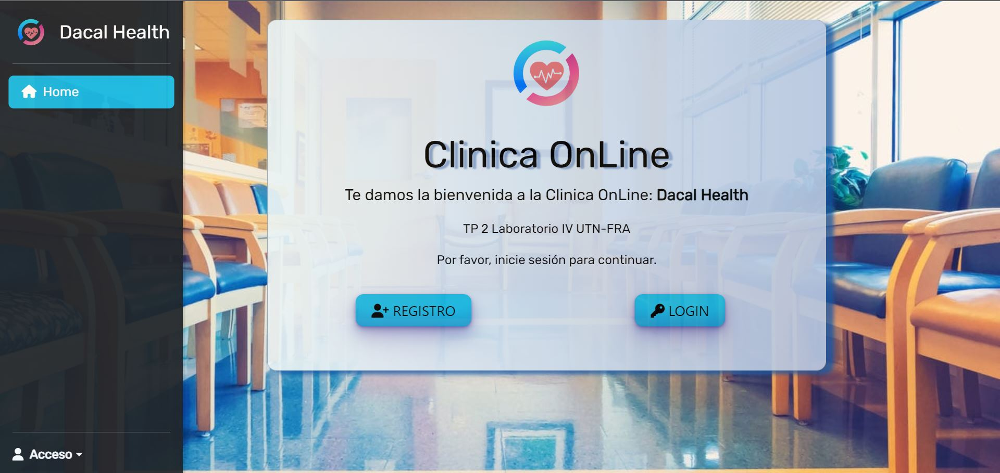
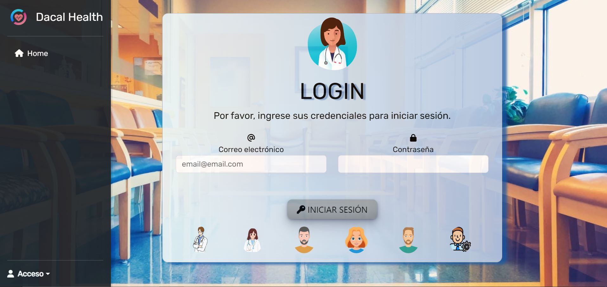

<h1>  Clinica OnLine: Dacal Health <h1>

<h1 align="center">CLINICA ONLINE</h1>

<h2>Requerimientos de la aplicación</h2>

Debemos realizar un sistema según las necesidades y deseos del cliente, para eso tenemos una breve
descripción de lo que el cliente nos comenta acerca de su negocio.

“La clínica OnLine, especialista en salud, cuenta actualmente con consultorios (6 en la actualidad),
dos laboratorios (físicos en la clínica), y una sala de espera general.

Trabajan en ella profesionales de diversas especialidades, que ocupan los consultorios acorde a su
disponibilidad, y reciben en ellos pacientes con turno para consulta o tratamiento. Dichos turnos son
pedidos por la web seleccionando el profesional o la especialidad. La duración mínima de un turno es
30 minutos.” pero los profesionales pueden cambiar la duración según su especialidad. Estos
profesionales pueden tener más de una especialidad.
También contamos con un sector dentro de la clínica que se encarga de la organización y
administración de la misma.

<h2>Home</h2>

<h2>Login</h2>

<h2>Registros</h2>

<h2>Mi perfil</h2>

<h2>Mis turnos (paciente)</h2>

<h2>Mis turnos (especialista)</h2>

<h2>Pacientes (especialista)</h2>

<h2>Seleccion usuarios</h2>

<h2>Turnos</h2>

<h2>Solicitud de turno y atención</h2>

<h2>Historia clinica</h2>

<h2>Informes</h2>

